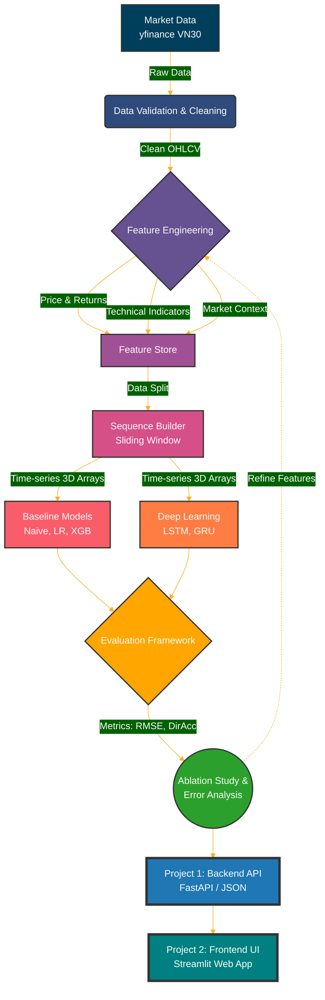
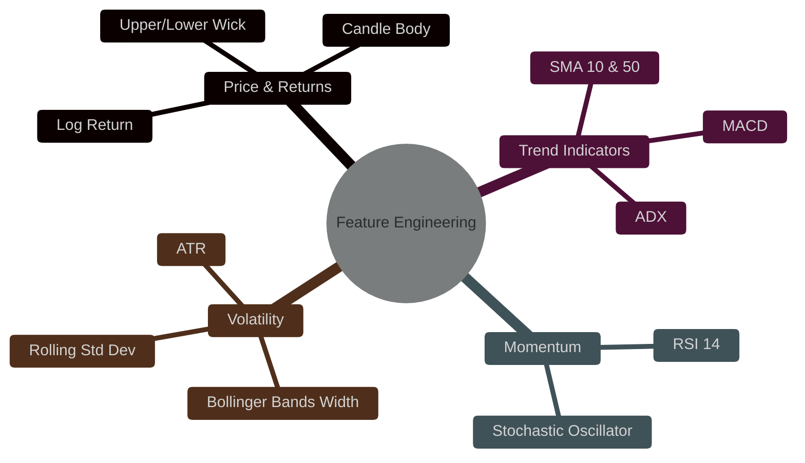
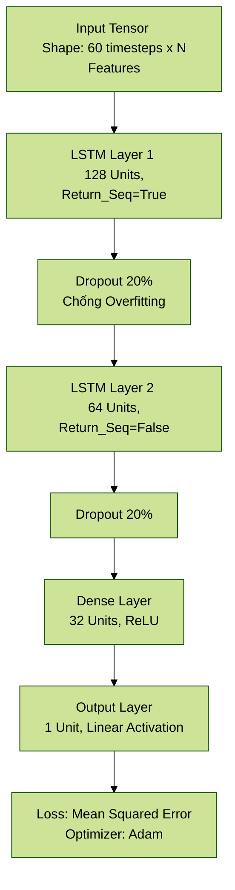

# 📈 VN30 Stock Price Prediction: End-to-End ML Pipeline

> **Project Statement:**
> *"Design and optimize an end-to-end financial time-series forecasting pipeline for the Vietnam Stock Market (VN30), focusing on data quality, leakage-free feature engineering, temporal validation, and model training."*

---

## 🌟 Tổng Quan Dự Án (Overview)

Dự án này xây dựng một hệ thống AI để dự đoán tỷ suất sinh lời (Return) của các mã cổ phiếu hàng đầu Việt Nam (FPT, HPG, VCB...). Trọng tâm không chỉ là viết một mô hình Deep Learning, mà là xây dựng một **Pipeline hoàn chỉnh** xử lý toàn bộ vòng đời của dữ liệu.



### 🔎 Giải Thích Từng Bước Trong Pipeline

| Bước | Tên Bước | Khái niệm & Ý nghĩa |
|:---:|:---|:---|
| 1️⃣ | **Market Data (Raw Input)** | Thu thập dữ liệu OHLCV (Open, High, Low, Close, Volume) thô từ Yahoo Finance cho các mã VN30 (FPT, HPG, VCB...). Đây là "nguyên liệu thô" đầu vào, chưa dùng được ngay vì còn nhiều lỗi tiềm ẩn. |
| 2️⃣ | **Data Validation & Cleaning** | Bước "làm sạch phòng" trước khi nấu ăn. Phát hiện và xử lý 3 vấn đề cốt lõi: *(a)* Ngày giao dịch bị thiếu (Missing Days) → Forward Fill; *(b)* Giá trị trùng lặp (Duplicate) → Dedup; *(c)* Giá điều chỉnh cổ tức (Adjusted Close) → `auto_adjust=True`. Nếu bỏ qua bước này, mọi thứ phía sau đều sai. |
| 3️⃣ | **Feature Engineering** | Không AI nào học tốt từ số giá thô. Bước này "dạy" model bằng cách tính toán thêm các chỉ báo định lượng: Trend (SMA, MACD), Momentum (RSI), Volatility (Bollinger Bands), Price Action (Log Return). Mỗi chỉ báo là một "góc nhìn" khác nhau về trạng thái thị trường. |
| 4️⃣ | **Feature Store** | Kho lưu trữ trung gian (file `*_features.csv`) chứa toàn bộ dữ liệu đã được tính toán và làm giàu. Tách biệt bước tính toán ra khỏi bước training để dễ debug và tái sử dụng. |
| 5️⃣ | **Sequence Builder (Sliding Window)** | **Bước then chốt nhất cho LSTM.** Cắt dữ liệu 2D thành mảng 3D `(Samples, Lookback, Features)`. Ví dụ: 60 ngày quá khứ liên tiếp = 1 "mẫu" để dự đoán ngày thứ 61. Đồng thời chia Train/Val/Test **theo trình tự thời gian** và scale dữ liệu về [0,1] để chống Data Leakage. |
| 6️⃣ | **Baseline Models** | "Mốc so sánh tối thiểu" (Sanity Check). Nếu LSTM không thể đánh bại nổi dự đoán đơn giản "ngày mai = ngày hôm nay", thì mô hình phức tạp kia vô nghĩa. Các Baseline gồm: Naive Forecast, Linear Regression, XGBoost. |
| 7️⃣ | **Deep Learning (LSTM/GRU)** | Mô hình chính của dự án. LSTM (Long Short-Term Memory) chuyên xử lý chuỗi thời gian nhờ cơ chế "cổng nhớ" (gates) giúp nó "nhớ" các xu hướng dài hạn và "quên" nhiễu ngắn hạn. GRU là phiên bản nhẹ hơn, train nhanh hơn để so sánh. |
| 8️⃣ | **Evaluation Framework** | Đo đạc khách quan bằng 2 góc độ: *(a)* Sai số định lượng (RMSE, MAE — lệch bao nhiêu tiền?); *(b)* Hướng dự đoán (Direction Accuracy — đoán trúng thị trường Lên/Xuống bao nhiêu %?). |
| 9️⃣ | **Ablation Study** | Thực nghiệm khoa học: bật/tắt từng nhóm Feature, thay đổi Lookback Window (10/30/60 ngày) để **chứng minh bằng số liệu** cái gì giúp model tốt hơn. Đây là phần quan trọng nhất cho báo cáo học thuật. |
| 🔟 | **FastAPI Backend (Project 1)** | Đóng gói model đã train thành một REST API chạy độc lập. Client chỉ cần gửi HTTP request với `{"ticker": "FPT.VN"}`, API trả về JSON `{"prediction": 120.5, "trend": "UP"}`. Không có giao diện. Chuẩn production. |
| 1️⃣1️⃣ | **Streamlit App (Project 2)** | Lớp Frontend giao diện người dùng. Không nhúng model trực tiếp mà gọi API ở bước trên, lấy kết quả và trực quan hóa bằng biểu đồ nến (Candlestick) tương tác. Giúp người không biết code cũng hiểu và dùng được model. |

---

## 🛠 Hướng Dẫn Cài Đặt (Setup & Run)

1. **Clone dự án về máy:**
   ```bash
   git clone <URL_GITHUB_CỦA_DỰ_ÁN>
   cd Stock_Prediction_Project
   ```
2. **Kích hoạt môi trường ảo (Virtual Environment):**
   ```bash
   # Windows (Mở Terminal / PowerShell)
   python -m venv venv
   .\venv\Scripts\activate
   
   # MacOS / Linux
   python3 -m venv venv
   source venv/bin/activate
   ```
3. **Cài đặt thư viện & Chạy Data Pipeline:**
   ```bash
   pip install -r requirements.txt
   
   # Tải dữ liệu VN30 (FPT, HPG, VCB...) bằng yfinance
   python src/data/download_dataset.py
   
   # Tính toán các chỉ báo kỹ thuật (Technical Indicators)
   python src/features/build_features.py
   ```
   *(Lưu ý: Không push thư mục `data/` lên Github để tránh nặng kho lưu trữ. Các thành viên tự clone về và chạy 2 lệnh Python trên).*

---

## 📂 Cấu Trúc Thư Mục (Project Tree)

```text
Stock_Prediction_Project/
├── data/                   
│   ├── raw/                # Dữ liệu gốc (OHLCV) từ yfinance (VD: FPT.VN_raw.csv)
│   ├── interim/            # Dữ liệu đã xử lý NaN, tính RSI, MACD...
│   └── processed/          # Dữ liệu Sliding Window (X_train.npy, y_train.npy)
├── models/                 # Chứa weights của model (lstm_v1.h5, xgboost.pkl)
├── notebooks/              # (Project 3) Jupyter notebooks (EDA, Build Model)
├── src/                    # Source code lõi
│   ├── data/               # Code download và validate dữ liệu
│   ├── features/           # Thuật toán định lượng (TA) & Sliding Window
│   ├── models/             # Định nghĩa kiến trúc Baseline, LSTM, GRU
│   ├── api/                # (Project 1) FastAPI Backend Server
│   └── app/                # (Project 2) Streamlit Frontend UI
├── reports/                # Hình ảnh báo cáo, biểu đồ so sánh, file PDF
├── README.md               # [Tài liệu này] Tổng quan kiến trúc & thuật toán
├── Team_Workflow.md        # Phân công task chi tiết cho 4 thành viên
└── requirements.txt        # Các thư viện phụ thuộc (yfinance, ta, pandas...)
```

---

## 🔬 1. Xác Định Bài Toán (Problem Formulation)

Thay vì dự đoán **Giá Tuyệt Đối (Raw Price)**, hệ thống này dự đoán **Tỷ Suất Sinh Lời (Return)**.
Lý do: Giá cổ phiếu là chuỗi *Non-stationary* (dao động xu hướng ngẫu nhiên và thay đổi phân phối liên tục). Tỷ suất sinh lời là *Stationary* (thường dao động ổn định quanh mốc 0%), giúp Machine Learning học dễ dàng và chính xác hơn.

Bài toán được frame theo 2 dạng kết hợp:
- **Regression:** Dự đoán chính xác % return ngày mai $\hat{r}_{t+1} = f(X_t)$
- **Classification (Phụ):** Đo lường **Direction Accuracy** (Đoán đúng hướng Tăng/Giảm).

---

## 🚧 2. Data Quality & Phòng Chống Leakage

Đây là hai "Boss" lớn nhất trong AI Tài Chính:

1. **Phân chia Cổ tức & Tách gộp:** Dự án sử dụng `yfinance` với `auto_adjust=True` để tự động điều chỉnh giá đóng cửa (`Close`), triệt tiêu các cú sập giá giả tạo do chia cổ tức.
2. **Missing & Outliers:** Quét và lấp đầy các ngày lễ (dùng Forward Fill).
3. **Data Leakage (Rò rỉ tương lai):**
   - **Scale Leakage:** `MinMaxScaler` CHỈ ĐƯỢC FIT trên tập Train. KHÔNG fit trên toàn bộ dataset.
   - **Chronological Split:** Tập Train, Val, Test phải được chia cắt theo trình tự thời gian (VD: Train 2018-2022, Val 2023, Test 2024). KHÔNG dùng hàm xáo trộn `shuffle=True`.

---

## 🧮 3. Thuật Toán Định Lượng (Feature Engineering)

Không thể chỉ ném giá thô vào mạng Neural. Chúng tôi tính toán 4 nhóm đặc trưng (Feature Sets) để cung cấp cho mô hình góc nhìn đa chiều về vi mô thị trường.



Mục tiêu là thực hiện **Ablation Study**: Chạy mô hình lần lượt với [Set 1], [Set 1+2], [Set 1+2+3] để chứng minh bằng số liệu rằng Feature Engineering thực sự giúp giảm sai số.

---

## 🧱 4. Kiến Trúc Mô Hình (Model Architecture)

Dự án áp dụng thang đo sức mạnh mô hình (Model Ladder) từ dễ đến khó để có mốc so sánh (Baseline) hợp lý:
`Naive Forecast` $\rightarrow$ `Linear Regression` $\rightarrow$ `XGBoost` $\rightarrow$ `GRU` $\rightarrow$ `LSTM`

### Kiến trúc Deep Learning: LSTM Network
Mô hình Deep Learning nhận dữ liệu dưới dạng **Sliding Window 3D Tensor** có shape `(Batch_Size, Lookback_Window, Features)`.



---

## 📊 5. Khung Đánh Giá (Evaluation Framework)

Hệ thống đánh giá mô hình bằng 2 khía cạnh độc lập:
1. **ML Metrics (Độ lệch chuẩn):**
   - **MAE (Mean Absolute Error):** Sai số tuyệt đối trung bình.
   - **RMSE (Root Mean Squared Error):** Phạt nặng các sai số lớn (Outliers).
2. **Direction Metrics (Độ chính xác xu hướng):**
   - **Direction Accuracy:** Tỷ lệ % số lần mô hình đoán trúng thị trường lên hay xuống vào ngày mai (Trọng số này rất quan trọng với Trader).

**Research Questions cần giải quyết trong báo cáo:**
- RQ1: Nhóm Feature (RSI, MACD, BB) nào đóng góp nhiều nhất vào độ chính xác?
- RQ2: LSTM có thực sự outperform được các mô hình ML truyền thống (XGBoost) không?
- RQ3: Kích thước cửa sổ trượt (Lookback = 10, 30, 60 ngày) ảnh hưởng thế nào đến RMSE?
