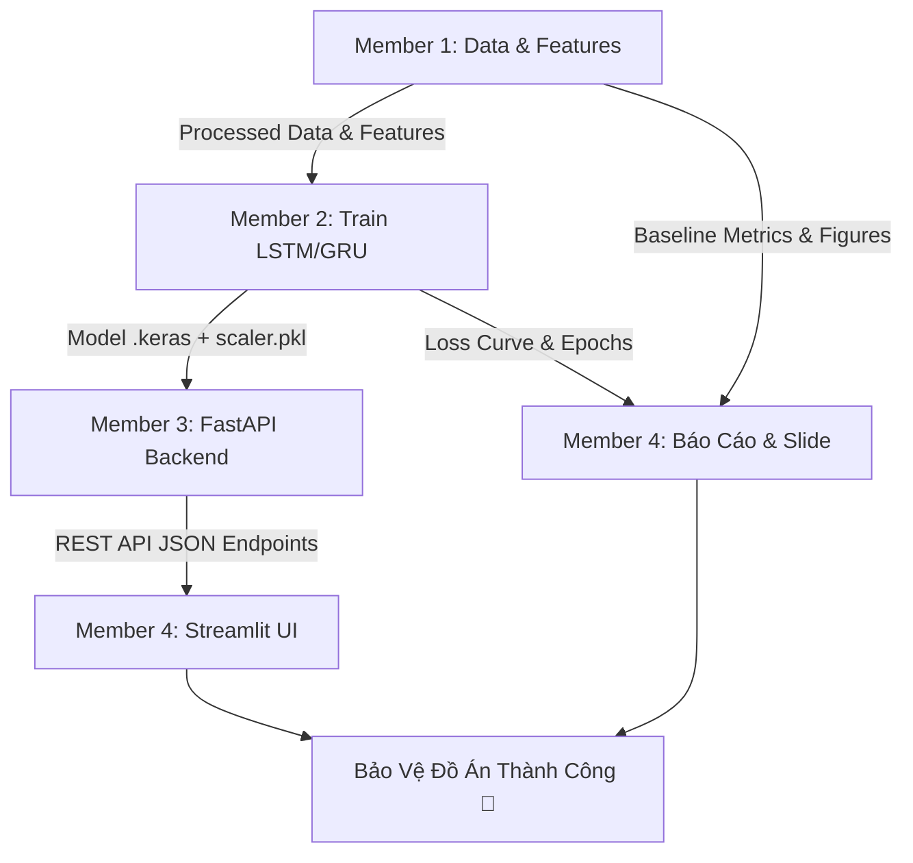

# 👨‍💻 Team Workflow & Roadmap (4 Thành Viên)
> **Mục tiêu:** Hoàn thành trọn vẹn **Project 3 (Modeling & Notebooks)**, **Project 1 (Deploy REST API)**, và **Project 2 (Streamlit UI - Tùy chọn cộng điểm)**.

Tài liệu này phân công cụ thể 4 mảng chuyên biệt cho 4 thành viên theo đúng phân công mới:
1. **Member 1:** Feature Engineering & Thuật toán Đánh giá (Data, Features, Baselines, Metrics).
2. **Member 2:** Huấn luyện Mô hình Deep Learning (LSTM, GRU, Cloud Training, Tuning).
3. **Member 3:** Xây dựng & Triển khai REST API (FastAPI Backend, Deploy serving model, Swagger UI).
4. **Member 4:** Giao diện Streamlit UI & Tổng hợp Báo cáo / Slide (Frontend Demo, Plotly, Docs).

---

## 1. 📊 MEMBER 1: FEATURES & THUẬT TOÁN ĐÁNH GIÁ (Data & Evaluation Lead)
**Trọng trách:** Nắm giữ "nguồn sống" dữ liệu và vai trò "giám khảo" độc lập. Chịu trách nhiệm tạo features định lượng, chạy các mô hình baseline truyền thống và tính toán toàn bộ chỉ số đánh giá.

### Nhiệm Vụ Cụ Thể (Roadmap)
- **Task 1.1: Ingestion & Data Cleaning:** Tải dữ liệu các mã VN30 (VCB, FPT, HPG...) qua `yfinance` hoặc `vnstock`. Xử lý missing values, trùng lặp ngày giao dịch và lọc nhiễu.
- **Task 1.2: Feature Engineering:** Sử dụng thư viện `ta` tạo các nhóm chỉ báo kỹ thuật:
  - *Trend:* SMA_20, SMA_50, MACD, MACD Signal.
  - *Momentum:* RSI_14, Stochastic Oscillator.
  - *Volatility:* Bollinger Bands (Upper, Lower, Width), ATR.
  - *Price Action:* Daily Return, Log Return, Price Spread (High - Low).
- **Task 1.3: Baseline Models:** Xây dựng các mô hình nền tảng đối chiếu:
  - *Naive Forecast:* Dự đoán ngày mai = giá đóng cửa hôm nay.
  - *Linear Regression / Ridge:* Baseline tuyến tính.
  - *XGBoost / Random Forest:* Đại diện mô hình Machine Learning dạng cây.
- **Task 1.4: Evaluation Metrics & Ablation Study:** 
  - Viết module tính các metric: **MAE**, **RMSE**, **MAPE**, và **Direction Accuracy** (đoán đúng hướng tăng/giảm).
  - Làm thí nghiệm so sánh (Ablation): Hiệu quả khi chỉ dùng Giá thô vs Dùng Giá + Full Features.
  - Xuất biểu đồ so sánh các thuật toán sang thư mục `reports/figures/`.

### 🛠️ Tech Stack & Kỹ Năng
- Thư viện: `pandas`, `numpy`, `ta` (Technical Analysis), `scikit-learn`, `xgboost`, `matplotlib`, `seaborn`.

### 🚨 Case Tree: Xử Lý Lỗi Thường Gặp
- **Lỗi NaN đầu chuỗi do tính chỉ báo:** Khi tính SMA_50 thì 49 ngày đầu bị NaN $\rightarrow$ Dùng `df.dropna()` sau khi tính toàn bộ features.
- **XGBoost không nhận mảng 3D:** XGBoost chỉ nhận bảng 2D $\rightarrow$ Dùng `X.reshape(X.shape[0], -1)` để flatten cửa sổ thời gian.
- **Data Leakage khi tính chỉ báo:** Đảm bảo tính features theo chuỗi thời gian xuôi, không dùng hàm trượt nhìn trước tương lai (no future lookahead).

---

## 2. 🧠 MEMBER 2: HUẤN LUYỆN MÔ HÌNH DEEP LEARNING (Model Lead)
**Trọng trách:** Kỹ sư xây dựng "bộ não" của hệ thống. Chuyên trách mạng nơ-ron sâu (LSTM, GRU), xử lý tensor 3D và tối ưu hóa trên GPU.

### Nhiệm Vụ Cụ Thể (Roadmap)
- **Task 2.1: Sliding Window & Scaling:**
  - Nhận dữ liệu sạch từ Member 1, chia Train / Val / Test theo trục thời gian tuyệt đối (Chronological Split, không shuffle).
  - Fit `MinMaxScaler` trên tập Train và transform cho Val/Test.
  - Cắt dữ liệu thành Tensor 3D trượt: `(Samples, Timesteps=60, Features=N)`.
- **Task 2.2: Xây dựng Kiến Trúc Deep Learning:**
  - Thiết kế mạng **LSTM:** Lớp LSTM 1 (return_sequences=True) $\rightarrow$ Dropout(0.2) $\rightarrow$ LSTM 2 $\rightarrow$ Dropout(0.2) $\rightarrow$ Dense.
  - Thiết kế mạng **GRU:** Để so sánh hiệu năng và tốc độ hội tụ so với LSTM.
- **Task 2.3: Cloud Training & Tuning (Colab/Kaggle):**
  - Tận dụng GPU T4 miễn phí trên Google Colab / Kaggle để train.
  - Cài đặt Callbacks: `EarlyStopping` (chống học vẹt), `ReduceLROnPlateau` (giảm LR khi loss đi ngang), `ModelCheckpoint`.
- **Task 2.4: Đóng Gói Mô Hình (Model Export):**
  - Lưu checkpoint mô hình tốt nhất ra định dạng chuẩn Keras (`best_model.keras` hoặc `model.h5`).
  - Lưu đối tượng `scaler.pkl` bằng `joblib` để Member 3 (REST API) có thể scale đúng dữ liệu khi predict.

### 🛠️ Tech Stack & Kỹ Năng
- Thư viện: `TensorFlow`, `Keras`, `scikit-learn`, `joblib`.
- Môi trường: Google Colab, Kaggle Notebooks, Jupyter Lab.

### 🚨 Case Tree: Xử Lý Lỗi Thường Gặp
- **Lỗi Shape Mismatch:** LSTM báo lỗi không khớp shape $\rightarrow$ Kiểm tra `input_shape=(lookback, n_features)`.
- **Overfitting (Train loss giảm sâu, Val loss vọt lên):** $\rightarrow$ Tăng Dropout (0.3 - 0.4), giảm số nơ-ron lớp ẩn hoặc tăng `patience` của EarlyStopping.
- **Tập test lệch thang đo:** $\rightarrow$ Khi predict xong, luôn nhớ gọi `scaler.inverse_transform()` để đưa giá dự đoán về đơn vị VND thực tế.

---

## 3. ⚙️ MEMBER 3: TRIỂN KHAI REST API - BACKEND (Deploy Lead)
**Trọng trách:** Triển khai **Project 1 (Deploy mô hình)** theo chuẩn REST API (No UI). Biến mô hình AI từ file tĩnh thành một dịch vụ có thể phục vụ dự đoán qua Internet.

### Nhiệm Vụ Cụ Thể (Roadmap)
- **Task 3.1: Thiết Kế Khung FastAPI:**
  - Khởi tạo project FastAPI tại `src/api/` hoặc `app.py`.
  - Cấu hình middleware CORS để cho phép các client (như Streamlit của Member 4 hoặc Postman/Web) gửi request.
- **Task 3.2: Xây Dựng Các Endpoint Dự Đoán:**
  - `GET /health`: Kiểm tra trạng thái server và phiên bản model đang nạp.
  - `GET /api/v1/tickers`: Danh sách các mã cổ phiếu hỗ trợ (VCB, FPT, HPG...).
  - `POST /api/v1/predict`: Nhận input (mã cổ phiếu hoặc chuỗi nến gần nhất), nạp vào model, trả về JSON chuẩn:
    ```json
    {
      "ticker": "FPT",
      "latest_close": 133.5,
      "predicted_next_close": 135.2,
      "expected_change_percent": 1.27,
      "trend_signal": "UP",
      "model_version": "LSTM_v1"
    }
    ```
- **Task 3.3: Tài Liệu Tự Động Swagger UI:**
  - Định nghĩa Schema dữ liệu đầu vào/đầu ra bằng `pydantic`.
  - Kiểm tra và tối ưu trang tài liệu tương tác Swagger (`http://localhost:8000/docs`) để thầy có thể bấm **"Try it out"** và test trực tiếp.
- **Task 3.4: Đóng Gói Deploy (Docker / Cloud Free):**
  - Viết `Dockerfile` và `requirements.txt` phục vụ riêng cho API.
  - Viết kịch bản deploy miễn phí lên **Render** hoặc **Hugging Face Spaces (Docker/FastAPI)** (hoặc chạy local phục vụ buổi bảo vệ).

### 🛠️ Tech Stack & Kỹ Năng
- Framework: `FastAPI`, `uvicorn`, `pydantic`.
- Deployment: `Docker`, `Render`, `Hugging Face Spaces`.

### 🚨 Case Tree: Xử Lý Lỗi Thường Gặp
- **API bị đơ khi load model Keras:** $\rightarrow$ Load model 1 lần duy nhất trong sự kiện startup (`@app.on_event("startup")` hoặc `lifespan context`), không load lại model trong từng request.
- **CORS Error khi Member 4 gọi:** $\rightarrow$ Khai báo `CORSMiddleware(allow_origins=["*"])`.
- **Lỗi Serialization NumPy:** Model trả về kiểu `np.float32` khiến FastAPI báo lỗi JSON $\rightarrow$ Luôn ép kiểu sang Python chuẩn `float(pred)`.

---

## 4. 🎨 MEMBER 4: GIAO DIỆN STREAMLIT & BÁO CÁO (Frontend & Docs Lead)
**Trọng trách:** Xây dựng **Project 2 (Streamlit UI - Tùy chọn cộng điểm)** và dẫn dắt phần tài liệu, slide thuyết trình để nhóm đạt điểm tối đa.

### Nhiệm Vụ Cụ Thể (Roadmap)
- **Task 4.1: Xây Dựng Streamlit Dashboard (Project 2):**
  - Tạo giao diện web trực quan, chuyên nghiệp: Sidebar chọn mã cổ phiếu, hiển thị thẻ KPI (Giá hiện tại, Giá dự đoán, Xu hướng TĂNG/GIẢM).
  - Tích hợp gọi REST API của Member 3 qua thư viện `requests` (Frontend tách bạch hoàn toàn với Model).
- **Task 4.2: Trực Quan Hóa Biểu Đồ (Plotly):**
  - Vẽ biểu đồ nến Candlestick lịch sử giá.
  - Vẽ điểm dự đoán ngày kế tiếp kèm đường xu hướng (Trend line).
  - Hiển thị các chỉ báo kỹ thuật cơ bản (RSI, SMA).
- **Task 4.3: Viết Báo Cáo Đồ Án (Word/PDF):**
  - Tổng hợp nội dung từ 3 thành viên:
    - *Chương 1:* Tổng quan bài toán dự đoán chuỗi thời gian VN30.
    - *Chương 2:* Tiền xử lý & Trích xuất Features (từ Member 1).
    - *Chương 3:* Kiến trúc mô hình Deep Learning LSTM/GRU (từ Member 2).
    - *Chương 4:* Kết quả thực nghiệm & So sánh Baselines (từ Member 1).
    - *Chương 5:* Kiến trúc Triển khai REST API & Web Demo (từ Member 3 & 4).
- **Task 4.4: Slide Thuyết Trình & Kịch Bản Demo:**
  - Thiết kế slide bảo vệ đẹp mắt, rõ ràng.
  - Chuẩn bị sẵn kịch bản demo live: Test gọi API trên Swagger (Project 1) $\rightarrow$ Thao tác trên Web Streamlit (Project 2).

### 🛠️ Tech Stack & Kỹ Năng
- UI Framework: `streamlit`.
- Biểu đồ: `plotly`, `requests`.
- Soạn thảo tài liệu: Markdown, Microsoft Word, Google Slides / Canva.

### 🚨 Case Tree: Xử Lý Lỗi Thường Gặp
- **Streamlit bị reload chậm khi tương tác:** $\rightarrow$ Dùng decorator `@st.cache_data` cho các hàm fetch data hoặc gọi API để tránh spam request.
- **API của Member 3 chưa chạy hoặc bị lỗi mạng:** $\rightarrow$ Bắt ngoại lệ `try...except requests.exceptions.ConnectionError`, hiển thị thông báo thân thiện `st.warning("Không thể kết nối đến REST API server")`.

---

## 📅 TIMELINE BÀN GIAO & GIAO DIỆN KẾT NỐI (INTERFACES)



| Giai đoạn | Công việc của 4 thành viên | Sản phẩm bàn giao (Interface Handover) |
| :--- | :--- | :--- |
| **Giai đoạn 1** *(Ngày 1 - 4)* | **M1:** Tải data VN30, tính features, test Baseline.<br>**M2:** Dựng kiến trúc LSTM, thử nghiệm tensor 3D.<br>**M3:** Tạo khung FastAPI, viết endpoint mẫu.<br>**M4:** Dựng layout Streamlit rỗng, mở dàn ý Báo cáo. | 📌 **M1 $\rightarrow$ M2:** File data đã làm sạch + features.<br>📌 **M3 $\rightarrow$ M4:** Quy ước chuẩn format JSON cho API. |
| **Giai đoạn 2** *(Ngày 5 - 9)* | **M1:** Chạy XGBoost, tính MAE/RMSE so sánh.<br>**M2:** Train LSTM & GRU trên Google Colab GPU.<br>**M3:** Viết logic load model vào FastAPI.<br>**M4:** Viết Chương 1, 2, 3 của Báo cáo. | 📌 **M2 $\rightarrow$ M3:** File trọng số `best_model.keras` + `scaler.pkl`.<br>📌 **M1 $\rightarrow$ M4:** Bảng chỉ số đối chiếu & ảnh đồ thị. |
| **Giai đoạn 3** *(Ngày 10 - 12)* | **M1 & M2:** Kiểm tra lỗi, tối ưu lại kết quả.<br>**M3:** Hoàn thiện Swagger docs & deploy local/cloud.<br>**M4:** Nối Streamlit với API, hoàn thiện Báo cáo & Slide. | 📌 **M3 $\rightarrow$ M4:** API URL chạy thực tế để kết nối UI.<br>📌 **M4:** Bản thảo Báo cáo và Slide gửi nhóm review. |
| **Giai đoạn 4** *(Ngày 13 - 14)* | **CẢ NHÓM HỌP CHUNG:**<br>- Chạy thử toàn bộ flow: Notebook $\rightarrow$ FastAPI $\rightarrow$ Streamlit.<br>- Diễn tập thuyết trình thử, phân công người nói từng phần. | 🚀 **SẴN SÀNG BẢO VỆ ĐỒ ÁN!** |

---

> **💡 LỜI KHUYÊN KHI BẢO VỆ VỚI THẦY:**
> 1. Trọng tâm điểm số nằm ở **Member 1 (Features & Đánh giá)** và **Member 2 (Huấn luyện Model)** vì đây là bản chất của môn Học Máy.
> 2. Điểm kỹ thuật triển khai nằm ở **Member 3 (REST API Deploy)**: Thầy sẽ rất ưng ý khi thấy Swagger UI `/docs` chạy mượt mà, trả về JSON chuẩn RESTful.
> 3. **Member 4 (Streamlit)** là điểm nhấn giúp phần demo trở nên sinh động và trực quan, giúp bài thuyết trình gây ấn tượng mạnh nhất với hội đồng.
